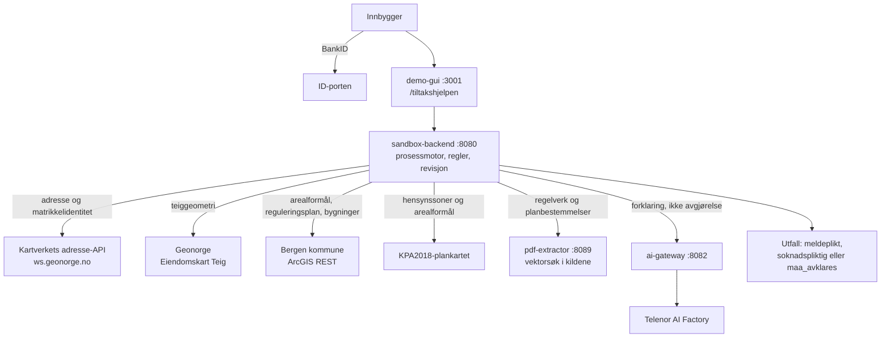
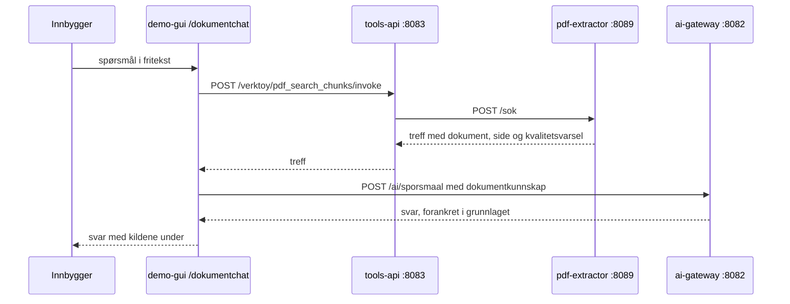

<p align="center">
  
</p>

# Kan du bygge uten å søke?

**Team Bergen** sin fork av [KS Digital sin Innbyggerdialog Sandbox](https://github.com/ks-no/workshop-ai).

Tiltakshjelpen svarer innbyggeren på om et byggetiltak er søknadspliktig, og slår opp
eiendommen, kartet og de lokale planene for henne. Sandkassen under er base-repoets og er
fortsatt beskrevet i denne filen. Det vi la til, står i de fem neste seksjonene.

## Problemet vi tar tak i

I 2025 ble det meldt inn 700 tilsynssaker på boligtiltak manuelt, og hver sak krever to
tilsynsbetjenter. Det er arbeid som oppstår etter at noe allerede er bygget.

Det finnes nasjonale veiledere for søknadsprosessen, men de stopper der spørsmålet blir
konkret: de henviser til de lokale planene, og å finne fram i dem er noe innbyggeren må
gjøre selv. I praksis står den som skal bygge igjen med tre valg:

- bygge, og håpe at det ikke var ulovlig
- lete gjennom flere hundre sider med reguleringsplaner og planbestemmelser
- kontakte Plan- og bygningsetaten og be om en konsultasjon

Det første er det som skaper tilsynssakene. Det andre krever at innbyggeren kan lese en
arealplan. Det tredje flytter arbeidet til kommunen, én samtale av gangen.

Tiltakshjelpen er et fjerde valg. Innbyggeren beskriver tiltaket sitt, og tjenesten slår
opp eiendommen, kartutsnittet og de lokale planene og svarer på om tiltaket er
søknadspliktig, med kilde på hvert ledd. Svaret er veiledning, ikke et vedtak: et
nasjonalt unntak er ikke en byggetillatelse, og det tjenesten ikke kan avgjøre, sier den
at må avklares.

## Hva de 700 sakene koster

Et overslag, ikke et regnskap. Under står forutsetningene hver for seg, slik at den som
er uenig i én av dem kan bytte den ut og regne om.

**Det vi vet.** 700 tilsynssaker på boligtiltak i 2025, to tilsynsbetjenter per sak.
Prisene er Bergen kommunes egne, fra gebyrforskriften for 2026 - som ligger i
dokumentbasen vår, og som vi fant tallene i ved å spørre dokumentchatten:

| Artikkel | Hva | Pris |
|---|---|---|
| `2026-440` | Gebyr for medgått tid, kontorarbeid, per påbegynt time | 1 920 kr |
| `2026-441` | Gebyr for medgått tid, markarbeid, per påbegynt time | 2 400 kr |
| `2026-3191` | Tilleggsgebyr per søknad om tiltak som er registrert som ulovlighet | 9 810 kr |

**Det vi antar.** At en tilsynssak koster 4 til 12 timer per betjent: varsel, forberedelse,
befaring med reise, rapport, korrespondanse og eventuell oppfølging. Og at innbyggeren
bruker 10 til 40 timer på sin side: finne fram dokumentasjon, stille på befaring, søke i
ettertid, og i verste fall rive eller bygge om.

**Regnestykket.** Et årsverk er satt til 1 695 timer.

| | Lavt anslag | Høyt anslag |
|---|---|---|
| Kommunale timer i året | 700 × 8 = **5 600 t** | 700 × 24 = **16 800 t** |
| Tilsvarer | **3,3 årsverk** | **9,9 årsverk** |
| Verdsatt til kommunens egne satser | **10,8 mill. kr** | **40,3 mill. kr** |
| Innbyggertimer i året | 700 × 10 = **7 000 t** | 700 × 40 = **28 000 t** |

I tillegg kommer 9 810 kroner i tilleggsgebyr for hver sak som ender med en søknad i
ettertid, og kostnaden ved å rive eller bygge om, som vi ikke har tall på og derfor ikke
gjetter på.

**Hva en avklaring på forhånd kan ta av dette.** Ikke alt. Saker som skyldes uenighet om
grenser, eller tiltak noen visste var ulovlige, forsvinner ikke av en veiviser. Men den
delen som skyldes at innbyggeren ikke fant ut hva som gjaldt, gjør det. Antar vi at
**20 til 40 prosent** av sakene er av den typen:

- **1 100 til 6 700 kommunale timer i året**, altså 0,7 til 4,0 årsverk
- **2,2 til 16,1 millioner kroner** målt mot kommunens egne satser for medgått tid
- **1 400 til 11 200 timer** spart hos innbyggerne, før gebyrer og riving

Det er intervallet vi mener er verdt å prøve, og tallet vi ville målt en pilot mot.

## Det vi bygget

Tre ting er våre. Alt annet i repoet kommer fra sandkassen slik den var.

- **[Tiltakshjelpen](docs/tiltakshjelpen.md)** - prosessen i Chat, AI-agent og Stegvis,
  og den frittstående veiviseren på <http://localhost:3001/tiltakshjelpen>. Den dekker
  frittliggende bygg, tilbygg, gjerde og fasade eller tak. Reglene er faste og ligger i
  backend, utenfor modellen: modellen forklarer, den avgjør ikke. Utfallene er
  `meldeplikt`, `soknadspliktig` og `maa_avklares`.
  Reglene kommer fra et [flytkart tegnet av en domeneekspert i Plan- og bygningsetaten i
  Bergen kommune](docs/flytkart-tiltakssjekk.md), som er skrevet ut node for node med en
  kolonne som sier hvor koden er enig og hvor den med vilje ikke er det.
- **[`pdf-extractor`](apps/pdf-extractor/README.md) (port `8089`)** - kildeforankret
  uttrekk fra lover, forskrifter og arealplaner, med en vektordatabase under
  `state/pdf-extractor/`. Side, koordinater og metode bevares gjennom hele kjeden, så et
  svar kan føres tilbake til siden det kom fra. Modelltekst får aldri overskrive kilden.
- **Dokumentchat** på <http://localhost:3001/dokumentchat> - fritekstspørsmål mot de
  indekserte PDF-ene. Den kjører uten prosessøkt og uten innlogging, med vilje.

To ting du ellers oppdager selv, så de står heller her. Dokumentchatten er ikke lenket
fra oversikten på `:3001`, så URL-en må skrives direkte. Og **PDF-ene indekseres ikke ved
oppstart**: med stacken oppe laster denne kommandoen inn de seks kildene i
`data/pdf/fixtures/` med profilen hver av dem skal ha.

```bash
node -e "
const m = JSON.parse(require('node:fs').readFileSync('data/pdf/fixtures/manifest.json','utf8'));
for (const d of m.documents) console.log(d.filename, d.profile);
" | while read -r fil profil; do
  curl -s -F "fil=@data/pdf/fixtures/$fil" -F "profil=$profil" \
    http://localhost:8089/dokumenter
  echo
done
```

Uten den svarer dokumentchatten «Søket fant ingen relevante utdrag i de indekserte
dokumentene». `GET http://localhost:8089/dokumenter` viser hva som ligger inne.

## Dataflyten

Ingen av tjenestene holder en kopi av svaret. Hvert ledd i vurderingen er et oppslag mot
kilden som eier det, og kilden følger med videre: hvilket API som svarte, når, og med
hvilket forbehold. Det er det som gjør at utfallet kan etterprøves i stedet for å måtte
stoles på.

### Datakilder

Oversikten er ikke ferdig. Den er ment å fylles på etter hvert som flere kilder kobles inn.

**Kart og eiendom, live over API:**

| Kilde | Hva den svarer på | Hvordan |
|---|---|---|
| [Kartverkets adresse-API](https://ws.geonorge.no/adresser/v1/) | adresse, matrikkelidentitet og adressepunkt | REST, åpent |
| [Matrikkelen - Eiendomskart Teig](https://kartkatalog.geonorge.no/metadata/uuid/74340c24-1c8a-4454-b813-bfe498e80f16) hos Geonorge | teiggeometrien for en konkret matrikkelidentitet | REST, GeoJSON |
| [Bergen kommunes karttjenester](https://kart.bergen.kommune.no/arcgis/rest/services) | arealformål, reguleringsplanområder og bygninger | ArcGIS REST |
| KPA2018, plankartet | hensynssoner og arealformål over hele eiendommen | GeoJSON gjennom `plan-mock` |

**Regelverk og dokumenter, indeksert i `pdf-extractor`:**

| Kilde | Hva den svarer på |
|---|---|
| Byggesaksforskriften (SAK10) med veiledning, Direktoratet for byggkvalitet | vilkårene for unntak fra søknad |
| Byggteknisk forskrift (TEK17) med veiledning, Direktoratet for byggkvalitet | høyder, avstander og tekniske krav |
| Plan- og bygningsloven, Lovdata | hjemlene vurderingen bygger på |
| KPA2018: bestemmelser og retningslinjer, Bergen kommune | planbestemmelsene selv |
| Bergen kommunes gebyrforskrift | hva en søknad eller en tilsynssak koster |
| Statens vegvesen: veiledning om avkjørsel | frisikt og avkjørsel mot vei |

Hver PDF er registrert med utsteder, hentetidspunkt og sha256 i
`data/pdf/fixtures/manifest.json`, og uttrekket beholder side og koordinater, så et svar
kan spores tilbake til siden det står på. Ingen av dem er kontrollert av en fagperson, og
et treff i en PDF gjør derfor aldri et vilkår kontrollert på egen hånd.

**To snarveier finnes bare for at demoen skal kjøre uten nett.** Et lokalt
Bergen-uttrekk brukes til de to demo-eiendommene, og `digdir-mock` utsteder tokenene i
stedet for ID-porten og Maskinporten. Begge byttes ut med den ekte kilden i en pilot.
Mangler en adresse i det lokale uttrekket, går oppslaget til Kartverkets API-er over,
og grensesnittet sier hvilken av dem som svarte.

### Tiltakshjelpen, fra innlogging til utfall



Hvem som svarer på hva, og hva svaret er verdt:

| Spørsmål i vurderingen | Kilde | Forbehold |
|---|---|---|
| Hvilke eiendommer eier innbyggeren? | eierforhold mot matrikkelidentiteten | Hjemmel ligger i grunnboken, ikke i matrikkelen |
| Hvor går tomtegrensen? | Kartverkets eiendoms-API | Kartanslag, ikke oppmålingsbevis |
| Hva er arealformålet, og finnes en reguleringsplan? | Bergens karttjenester, live | Tilgjengelig geometri er ikke nøyaktige grenser |
| Berører tiltaket en hensynssone? | KPA2018-plankartet | Frosset i 2018, og flatene er klippet til kartutsnittet |
| Finnes det bebyggelse på eiendommen? | Bergens bygningslag, live | Treg kilde: oppslaget prøves to ganger før det gis opp |
| Er tiltaket søknadspliktig? | `sandbox-backend`, faste regler etter SAK10 § 4-1 | Ingen modell er involvert |
| Hvordan forklares det? | `ai-gateway` mot Telenor AI Factory | Kan ikke gjøre utfallet mildere enn reglene |

Den siste raden er en sperre i kode, ikke en instruks i prompten:
`apps/ai-gateway/src/tiltakshjelpen-raad.ts` leser modellens egne setninger og avviser
prosa som gjør utfallet mildere enn den deterministiske vurderingen.

### Dokumentchatten, to kall per spørsmål



Tre ting er verdt å vite om det siste kallet. `ai-gateway` beholder høyst tre treff og
kutter hver tekst, så et bredt søk gir ikke et bredere svar. Prompten sier at modellen
bare skal svare ut fra grunnlaget, og spørsmålet sendes inn som data, ikke som en
instruks. Og tjenestenavnet er `Dokumentarkiv` med vilje, så spørsmålet ikke havner på
Tiltakshjelpens egen svarvei.

`/ai/sporsmaal` har ingen egen datatilgang. Den svarer bare fra grunnlaget kalleren
sender med, og det er det som gjør at den strukturelt ikke kan nå data bak samtykkeporten.

## Modellene vi kjører på

Vi kjører mot **Telenor AI Factory**, et OpenAI-kompatibelt LiteLLM-endepunkt. Sett
`AI_PROVIDER=telenor-ai-factory` og `TELENOR_AI_FACTORY_API_KEY` i `.env`, eller bytt
provider live på <http://localhost:8082/admin>. Tre modeller er tilgjengelige:

| Modell | Tenker | Hva målingen viste |
|---|---|---|
| `NVIDIA-Nemotron-3-Super-120B-A12B-FP8` | ja | Rakk den tunge tiltaksvurderingen på 8,4 sekunder. Standardvalget for reasoning-oppgavene |
| `GLM-5.2-FP8` | ja | Ble kuttet av taket på en full tiltaksvurdering i tre av tre forsøk |
| `Qwen3-Coder-Next-FP8` | nei | Ingen tenkemodus: svarer likt med og uten `enable_thinking` |

Tenkingen slås på per oppgave, ikke som en global innstilling. Policyen er
`OPPGAVE_REASONING` i `apps/ai-gateway/src/reasoning.ts`, og `pnpm test:reasoning` gjør en
ny oppgave rød i stedet for at den arver «tenker ikke» i stillhet. Selve tenkingen lagres
i `reasoningResponse` i KI-sporet og vises som en egen blokk i `/trace`, så en modell som
tenkte er like etterprøvbar som en som ikke gjorde det.

Endepunktet ligger bak en API Gateway som kutter forbindelsen etter 30 sekunder.
`TELENOR_AI_FACTORY_TIMEOUT_MS` er derfor taket for denne provideren, ikke `AI_TIMEOUT_MS`.
Variablene står i `.env.example`; verdiene deres hører hjemme i din lokale `.env`, som er
gitignorert.

## Innhold

<details>
<summary>Alle seksjonene</summary>

- [Problemet vi tar tak i](#problemet-vi-tar-tak-i)
- [Hva de 700 sakene koster](#hva-de-700-sakene-koster)
- [Det vi bygget](#det-vi-bygget)
- [Dataflyten](#dataflyten)
- [Modellene vi kjører på](#modellene-vi-kjører-på)
- [Før du begynner](#før-du-begynner)
- [Hva sandkassen er](#hva-sandkassen-er)
- [Designprinsipp for hackathon](#designprinsipp-for-hackathon)
- [Status](#status)
- [Hva som logges](#hva-som-logges)
- [Hvordan starte den](#hvordan-starte-den)
- [Hvordan stoppe den](#hvordan-stoppe-den)
- [Oversikt over tjenester og porter](#oversikt-over-tjenester-og-porter)
- [Demo-brukere](#demo-brukere)
- [Demo-flyt](#demo-flyt)
- [Eksempel på API-kall](#eksempel-på-api-kall)
- [Sjekker du kan kjøre](#sjekker-du-kan-kjøre)
- [Hvor syntetiske data ligger](#hvor-syntetiske-data-ligger)
- [Hvordan legge til nye prosesser](#hvordan-legge-til-nye-prosesser)
- [Hvordan legge til nye syntetiske datasett](#hvordan-legge-til-nye-syntetiske-datasett)
- [Samarbeid](#samarbeid)
- [Kjente begrensninger](#kjente-begrensninger)
- [Viktige filer](#viktige-filer)

</details>

## Før du begynner

Dette må du ha installert på maskinen din:

| Hva                               | Trengs til | Hent den |
|-----------------------------------|---|---|
| **Docker**, installert og startet | å kjøre sandkassen. Det eneste kravet for `./start.sh --mock` | [docs.docker.com](https://docs.docker.com/get-docker/) |
| **git**                           | å hente repoet | [git-scm.com](https://git-scm.com/downloads) |
| **Node 22.18 eller nyere**        | å hente et token (`node scripts/token.ts`), og å kjøre testskriptene. **Nesten alle API-kall krever token**, så i praksis trenger du Node så snart du gjør noe selv | [nodejs.org](https://nodejs.org/en/download) |
| **pnpm**                          | å kjøre `pnpm <skript>` i det hele tatt. `pnpm install` i tillegg bare til `pnpm lint`, live reload på Windows, og Bedrock-provideren - verken sandkassen eller de andre testskriptene trenger et `pnpm install` | [pnpm.io](https://pnpm.io/installation) |
| **Homebrew** (bare macOS)         | at skriptet kan installere Ollama for deg. Ikke nødvendig med `--mock` | [brew.sh](https://brew.sh) |

Har du allerede Node, er `corepack enable` som regel nok til å få pnpm - `package.json`
sier hvilken versjon som skal brukes. Følger ikke Corepack med din Node-versjon, tar
lenken over de andre veiene.

Sjekk at du har det:

```bash
docker --version && node --version && git --version
```

**Portene `3000`, `3001` og `8080`-`8090` må være ledige.** Med modell trengs også
`11434` til Ollama. Er en av dem
opptatt, står det i `docs/feilsoking.md` hvordan du finner ut hvilken.

**Sett av tid første gang: 4-7 minutter** med `./start.sh --mock`, **12–25 minutter**
med språkmodell, og vesentlig mer på delt konferansenett. Språkmodellen er fra 400 MB
til 9 GB avhengig av hvor mye minne maskinen har. Senere oppstarter tar sekunder.

På Windows: kjør fra Git Bash (følger med Git for Windows) eller [WSL](https://learn.microsoft.com/windows/wsl/install) - se [«På Windows»](#på-windows) lenger ned.

> [!NOTE]
> **Deltaker på hackathon? Denne filen er ikke inngangen din.** Fire sider, i rekkefølge:
>
> 1. [`docs/oppdraget.md`](docs/oppdraget.md) - hva dere skal lage, og hva som er fritt
> 2. [`docs/deltakerstart.md`](docs/deltakerstart.md) - én kommando, URL-ene, hvilken
>    demobruker som hører til hvilken case, første eget API-kall, og feilsøking
> 3. [`docs/bygg-selv.md`](docs/bygg-selv.md) - egen frontend på egen port, egne
>    tjenester, og hva som er frosset
> 4. [`docs/innlevering.md`](docs/innlevering.md) - hva som må ligge i forken før fristen,
>    og hvordan dere registrerer teamet
>
> Og før du begynner: [`CODE_OF_CONDUCT.md`](CODE_OF_CONDUCT.md) gjelder alle, i lokalet og i repoet.
>
> Kom tilbake hit når du vil ha hele bildet: alle flagg, porter og kjente begrensninger.
>
> [`docs/README.md`](docs/README.md) er kartet over all dokumentasjonen.

## Hva sandkassen er

Resten av denne filen beskriver gulvet Tiltakshjelpen står på: sandkassen slik den kom
fra KS Digital. Den er en lokal utviklingsarena for å utforske hvordan innbyggere kan møte
kommunen, med prosessmotor, samtykke som faktisk sperrer, deterministiske regler utenfor
modellen, revisjonslogg og mockede integrasjoner. Demoene der er dialogbaserte fordi en
samtale var raskeste vei til å ta i bruk alle API-ene samtidig - ikke fordi dialog er
svaret. Se `docs/oppdraget.md`.

Sju demo-case fulgte med; `Redusert foreldrebetaling i barnehage` er flaggskipet blant dem
og det eneste som er dekket av en informasjonsmodell. Casene og hvilken testbruker som
hører til hver, står i `docs/deltakerstart.md`.

Arkitekturen er lagt opp for samarbeid mellom flere team, med tydelige grenser mellom frontend, backend, simulatorer, policyer og datasett.

## Designprinsipp for hackathon

Høy autonomi, og nok støtte til at teamene faktisk rekker å levere: felles API-er og enkle integrasjonsflater, uten å låse noen til én bestemt frontend, ett bestemt prosessformat eller ett bestemt verktøy. Referanseimplementasjonene i repoet, som `process-builder` og `demo-gui`, er hjelpemidler og eksempler - ikke tvungne måter å bygge løsningene på.

## Status

Tretten kjørende tjenester, én valgfri avhengighet i kjøretid, sju komplette demo-case. På plass:

- samtykkeflyt med sperre på inntektsdata uten samtykke, håndhevet ett sted
- revisjonslogg over all datatilgang
- deterministisk vilkårsvurdering mot satser (`SJEKK`) - utenfor modellen, med vilje
- syntetiske data forankret i Folkeregisterets informasjonsmodell og KS Fiks beregnings-API
- KI-spor: hvert modellkall lagres med prompt og svar, lesbart på `GET /trace`
- evals av KI-laget: `pnpm test:eval`
- OpenAPI for alle elleve API-tjenestene, komplett og holdt i takt med koden av
  `pnpm test:openapi`: hver rute dokumentert, med `security:` per rute

Det vi la til:

- Tiltakshjelpen, med faste regler etter SAK10 § 4-1 og et flytkart fra Plan- og
  bygningsetaten i Bergen kommune, skrevet ut node for node i
  `docs/flytkart-tiltakssjekk.md`
- kildeforankret uttrekk og vektorsøk i lover, forskrifter og arealplaner
  (`pdf-extractor`), der side og koordinater følger med hele veien
- dokumentchat mot de samme kildene, på `/dokumentchat`
- Telenor AI Factory som provider, med tenking slått på per oppgave og pinnet av
  `pnpm test:reasoning`

## Hva som logges

**Loggene sier hva sandkassen gjorde, ikke hvem som kjørte den.** Ingen brukerkonto,
ingen tilgangslogg, ingen bruksmålinger, og ingenting sendes til KS Digital. To ting
lagres med vilje, begge i `state/` på din egen maskin:

- **Revisjonsloggen** (`state/revisjonslogg.json`) - én hendelse hver gang sandkassen
  leser data, endrer et samtykke, tar et prosessteg eller kaller modellen.
- **KI-sporet** (`state/ai-trace.jsonl`) - full prompt og fullt svar per modellkall.

Kjører du mot en KI-provider som ikke er lokal, går hele prompten ut av maskinen. Og
`./start.sh --reset` legger en kopi av `state/` i `_backup/` før den sletter.
[`docs/hva-logges.md`](docs/hva-logges.md) har hele bildet.

## Hvordan starte den

Kravene til maskinen står under [«Før du begynner»](#før-du-begynner).

**Vil du bare se noe kjøre? Start her:**

```bash
./start.sh --mock
```

Fire til sju minutter. Alt fungerer bortsett fra at KI-svarene er maltekst i
stedet for modellgenerert - flyten, samtykkesperren, revisjonsloggen og alle
API-ene er de samme. Dette er den riktige veien inn første gang, og den eneste
som ikke krever nedlasting av flere gigabyte.

Når du vil ha den ekte modellen:

```bash
./start.sh
```

Skriptet finner ut hvilken plattform du er på, velger modell ut fra minnet i
maskinen, starter tjenestene, og verifiserer at modellen faktisk svarer før den
melder klar.

Tidsbruken første gang står under [«Før du begynner»](#før-du-begynner); en stor modell
legger seg i overkant av det. Skriptet spør før det laster ned. På macOS spør det i tillegg før det installerer Ollama, siden den kjører nativt der; på Linux og WSL kjører Ollama i container og installeres ikke. `./start.sh -y` hopper over alle spørsmål.

Stopp med `./start.sh -d`.

### På Windows

Kjør skriptet fra Git Bash eller WSL. Da får du plattformdeteksjon,
automatisk modellvalg basert på minnet i maskinen, og verifisering av at modellen
faktisk svarer.

`start.bat` og `stop.bat` finnes i repoet, men de er et nødløsningsalternativ, ikke en
ekvivalent. `start.bat` sjekker portene, lager `.env` hvis den mangler, og venter til alle
tretten tjenestene svarer på `/helse`. Den tar `--reset`, `--reload`, `-d`, `--down` og
`--help`, men ingen modellflagg. **Den kjører alltid uten
språkmodell** - den laster verken ned eller velger modell, så alt annet enn maltekst
ville vært en tom lovnad. Vil du ha en ekte modell, bruk Git Bash eller WSL og
`./start.sh`. Foretrekk uansett den veien hvis du har valget.

### Valg

Du skal normalt ikke trenge noen av disse.

| Flagg | |
|---|---|
| `-m, --model MODEL` | Bruk en bestemt modell i stedet for den automatisk valgte |
| `-y, --yes` | Ikke spør før installasjon eller nedlasting |
| `--mock` | Kjør uten språkmodell. Raskeste vei inn, og redningen når nedlasting ikke er mulig |
| `--reload` | Gjenskap Node-containerne, også når konfigurasjonen er uendret. Tar inn kode og Compose-endringer uten å slette `state/` |
| `--reset` | Stopp Node-tjenestene, kopier `state/` til `_backup/`, tøm den, og gjenskap containerne fra kildedataene |
| `-d, --down` | Stopp alt |
| `-h, --help` | Hjelp |

> [!WARNING]
> **`--reset` er ikke bare en reset.** Den tømmer `state/` og starter deretter alt på
> vanlig måte - inkludert modellnedlasting. Kjørte du `--mock`, skriv
> **`./start.sh --mock --reset`**, ellers begynner den å laste ned flere gigabyte.

Ta også med `--mock` ved omlasting: `./start.sh --mock --reload`. `--reset`,
`--reload` og `--down` er separate operasjoner og kan ikke kombineres.
Et lagret valg i KI-admin overstyrer fortsatt miljøvariabler. Dersom det hindrer
mock-modus, stopper skriptet med en forklaring i stedet for å melde at alt er klart.

### Hva skriptet gjør for deg

**Plattform** oppdages automatisk:

| Plattform | Hvordan Ollama kjøres |
|---|---|
| macOS | Nativt på verten. Docker Desktop når ikke Metal på Apple Silicon, så Ollama i container ville blitt ren CPU-inferens. |
| Linux med NVIDIA-GPU | I container, med `docker-compose.gpu.yml` |
| Linux og WSL ellers | I container, uten GPU |

**Modell** velges ut fra minnet på maskinen: 32 GB RAM eller mer gir `qwen2.5:14b`, 12 GB eller mer gir `qwen2.5:7b`, under det `qwen2.5:0.5b`.

Har du et NVIDIA-kort, leses også VRAM, og det mest restriktive av de to avgjør - en modell som får plass i RAM men ikke i VRAM blir splittet mot CPU og går tregt. Apple Silicon har unified memory, så der er RAM riktig tall.

Har du satt `OLLAMA_MODEL` i miljøet eller i `.env`, brukes den i stedet. `.env` opprettes fra `.env.example` hvis den mangler.

**Til slutt bekreftes det at modellen svarer.** Sier skriptet `⚠️ The model is NOT connected`, virker sandkassen fortsatt - men AI-svarene er maler. Vanligste årsak er at Ollama har stoppet.

### Kildedata og kjøringstilstand

`data/` er kildedata og skrives aldri til. Alt tjenestene endrer under kjøring havner i `state/`, som er gitignorert. En demokjøring skitner derfor ikke til arbeidstreet - kjører du en flyt og deretter `git status`, skal den være ren.

`./start.sh --reset` stopper først alle Node-tjenestene, tar en sikkerhetskopi uten
signeringsnøkkelen og sletter så `state/`. Feiler stopp eller kopiering, slettes
ingenting. Containerne gjenskapes etterpå, slik at lagret KI-valg, tokenbuffer og
agentøkter i minnet også nullstilles. Ollama på macOS og nedlastede modeller beholdes.
Stopp eventuelle tjenester du har startet utenfor Compose selv før du nullstiller.
Se `docs/syntetiske-data.md`, også for hvordan du deler en prosess du har laget i byggeren.

### Hvis noe ikke virker

Kontroller at modellen er koblet på:

```bash
curl -s http://localhost:8082/helse
```

`"modellNaaBar": true` betyr at provideren svarer og modellen er lastet ned. Er den `false`, følger et `feil`-felt som sier hvorfor. Merk at status alltid er 200 - tjenesten lever selv om modellen ikke gjør det, så det er `modellNaaBar` du skal lese.

Er modellen nede, faller `ai-gateway` tilbake til maltekst og setter et `advarsel`-felt. `/chat` og `/agent` viser en gul stripe når det skjer, og `./start.sh` advarer ved oppstart - men svarene i seg selv ser normale ut, så det er verdt å vite hvor du sjekker.

Kontroller at alle tjenestene kjører:

```bash
docker compose ps
```

Alle skal stå som `healthy`.

Alt annet - `401` på alt, «fetch failed» på matrikkel-oppslag, maltekst du ikke ba
om, port opptatt, en container som ikke blir `healthy`, treg modellnedlasting og
hvordan du nullstiller - står i `docs/feilsoking.md`: ett symptom per avsnitt, med
årsak og løsning.

### Se hva modellen faktisk gjorde

```
http://localhost:8082/trace
```

Ett kall per linje, nyeste øverst, med full prompt og fullt svar før heuristikk og validering har vært innom - pluss varighet, modell og om det feilet. Samme data som JSON på `GET /trace.json`, med `?sporingsId=`, `?task=` og `?limit=`.

Sporet ligger i `state/ai-trace.jsonl` og nullstilles av `./start.sh --reset`.

Logger: `docker compose logs -f ai-gateway`.

### Manuell oppstart

<details>
<summary>Kommandoene, per plattform</summary>

`./start.sh` gjør dette for deg. Les skriptet hvis du vil se detaljene - det er kommentert.

macOS, med Ollama nativt på verten:

```bash
brew services start ollama    # ikke "ollama serve" - den dør når terminalen lukkes
ollama pull qwen2.5:14b
cp .env.example .env          # OLLAMA_BASE_URL=http://host.docker.internal:11434
docker compose up -d --no-deps sandbox-backend fiks-simulator ai-gateway \
  tools-api process-agent matrikkel-mock digdir-mock pasientjournal-mock \
  politiattest-mock demo-gui process-builder
```

**Hele listen må med** - særlig `digdir-mock` og `matrikkel-mock`, som svikter stille
når de mangler. Hvordan de feiler står i punktlisten under
[tjenesteoversikten](#oversikt-over-tjenester-og-porter).

`--no-deps` er nødvendig for å hoppe over `depends_on: ollama` i `ai-gateway`, som
ellers drar opp container-Ollama - men det er også grunnen til at listen må være
komplett: `--no-deps` slår av `depends_on` for *alle* tjenestene, `digdir-mock`
inkludert.

Linux og WSL, alt i Docker:

```bash
./start.sh --mock             # uten modell
# eller, med modellvalg, nedlasting og verifisering:
./start.sh -y
```

Bruk skriptet også her. En ren kopi av `.env.example` peker på macOS-verten, ikke
på Ollama-containeren, og `docker compose up -d` laster ikke ned noen modell.
Skriptet lager riktig `.env` når den mangler. Har du allerede kopiert eksempelfilen
på Linux/WSL, rett `OLLAMA_BASE_URL` til `http://ollama:11434` før du starter;
en eksisterende `.env` blir ikke overskrevet.

Med NVIDIA-GPU velger skriptet GPU-overlegget når Docker har NVIDIA-støtte.
Verifiser GPU-tilgangen med `docker run --rm --gpus all nvidia/cuda:12.4.1-base-ubuntu22.04 nvidia-smi` - feiler den, mangler [NVIDIA Container Toolkit](https://docs.nvidia.com/datacenter/cloud-native/container-toolkit/latest/install-guide.html).

Forhåndslast alle anbefalte modeller, for eksempel før en workshop med dårlig nett:

```bash
docker compose --profile models up ollama-pull-all
```

Modellene er `qwen2.5:0.5b` (raskest), `qwen2.5:7b` (balansert), `qwen2.5:14b` (best av Qwen-variantene), `llama3.1:8b` og `mistral-nemo`.

</details>

## Hvordan stoppe den

```bash
./start.sh -d
```

Eller direkte med `docker compose down`. På macOS kjører Ollama utenfor Docker og stoppes med `brew services stop ollama` hvis du vil frigjøre minnet.

## Oversikt over tjenester og porter

`./start.sh` starter alle sammen, så du trenger ikke velge.

Tjenestene, portene og rollene deres ligger i `apps/shared/tjenester.json`, og
<http://localhost:3001> viser dem med levende helsestatus og en lenke rett inn i
API-utforskeren for hver.

To ting tabellen ikke sier, og som er verdt å vite før noe feiler:

- **`digdir-mock` (`8086`) utsteder alle tokens.** Er den nede, svarer hvert autentisert
  kall 401 mens `docker compose ps` ser helt frisk ut, fordi tokenfeilen svelges i
  klienten. Den skal alltid med når du starter tjenester manuelt.
- **`matrikkel-mock` (`8085`) er kjerne, selv om den ser valgfri ut.** Uten den feiler
  alle `matrikkel_*`-verktøy og hele `fartsdempende-tiltak`-casen med «fetch failed»,
  mens alt annet ser normalt ut.
- **`pdf-extractor` (`8089`) starter tom.** Dokumentene indekseres ikke ved oppstart, så
  dokumentchatten og dokumentkildene svarer ingenting før kildene er lastet inn. Kommandoen
  står under [«Det vi bygget»](#det-vi-bygget).

Hver API-tjeneste serverer sin egen spesifikasjon på `/openapi.yaml`, samme spesifikasjon
lest som JSON på `/openapi-ruter.json`, og en lesbar side på `/docs`. Den midterste er det
API-utforskeren rendrer, og `pnpm test:openapi` holder alle tre i takt med koden.


## Demo-brukere

Det finnes ikke én demo-bruker som passer alle casene - velg bruker etter case i
tabellen i `docs/deltakerstart.md` §3, som er pinnet i `data/deltakercaser.json`.
Til flaggskipcaset *Redusert foreldrebetaling (barnehage)* passer `person-001`
`Maja Solberg`; i flere av de andre casene gir hun korrekt avslag, så der velger
du bruker fra tabellen.

Data finnes i `data/personer.json`. **`docs/testpersoner.md` er den genererte
oversikten over hele befolkningen** - personer med alder, status, husstand og
en kolonne som sier om personen kan logge inn, bare være part, eller ingen av
delene. `docs/syntetiske-data.md` forklarer datagrunnlaget.

## Demo-flyt

*Tiltakshjelpen* er casen vi bygde, og den kjører slik: innbyggeren logger inn med BankID,
velger en av sine egne eiendommer, beskriver tiltaket i fritekst, bekrefter hvilken type
det er, og plasserer det i kartet. Backend slår opp teiggeometri, arealformål,
reguleringsplan, hensynssoner og eksisterende bebyggelse, vurderer vilkårene
deterministisk, og KI-laget forklarer resultatet med kilde per ledd. Utfallet er
`meldeplikt`, `soknadspliktig` eller `maa_avklares`. Ingen søknad sendes inn. Bruk
`person-395` **Milda Garasjetest** eller `person-396` **Kåre Garasjetest**.

Basens flaggskipcase *Redusert foreldrebetaling (barnehage)* kjører hele kjeden i én økt:
husstanden hentes og vises, samtykke innhentes før inntektsdata leses, vilkårene
vurderes deterministisk i backend, KI-laget oppsummerer i klarspråk, innbyggeren
bekrefter, søknaden sendes inn og oppretter en oppgave i Fiks-simulatoren - og
revisjonsloggen viser hver datatilgang underveis.

Demo-GUI-en er prosessdrevet: stegene leses fra valgt prosessdefinisjon, og flyten
kjøres via prosessøkt-API-et i backend. Alle sju casene, og hvilken testbruker som
hører til hver, står i tabellen i `docs/deltakerstart.md` §3, pinnet i
`data/deltakercaser.json`.

## Eksempel på API-kall

**Kall krever token.** `AUTH_ENFORCE` er på som standard, og alt som ikke er uttrykkelig
åpent svarer `401` uten `Authorization`-header.

```bash
export TOKEN=$(node scripts/token.ts --innbygger person-001)
curl -s -H "Authorization: Bearer $TOKEN" \
  http://localhost:8080/api/personer/person-001/husstand
```

Ett token er én person: `person-001`s token åpner ikke `person-031`s data - det gir
`403`. `pnpm token` treffer pnpms egen innebygde kommando, så kall skriptet direkte.

Åpne ruter trenger ingenting: `/helse`, `/docs`, `/openapi.yaml`, `/api/prosesser`,
`/api/katalog/*`, `/api/regler/satser`. `GET /api/katalog/ressurser` oppgir `tilgang` og
`kreverSamtykke` per rute, så du kan lese ut av API-et selv hva som krever hva.

**Videre:**

- <http://localhost:3001/utforsker> - hver rute med skjema, riktig token valgt
  automatisk, og en `curl` som virker når den limes inn. Raskeste vei til et enkeltkall.
- `examples/curl/README.md` - flytene: hele barnehagesøknaden i rekkefølge, og de tre
  ulike svarene samme URL gir avhengig av token og samtykke. `pnpm test:kokebok` kjører
  hvert kall i filen, så et eksempel som ikke virker er en reell feil.


## Sjekker du kan kjøre

Disse krever ingen kjørende tjenester og ingen modell:

```bash
pnpm lint            # tsc --noEmit
pnpm test            # referanseintegritet og scenariodekning i datasettene
pnpm test:kontrakt   # starter egen backend + fiks og skriver en deterministisk dump
```

`pnpm test:kontrakt` normaliserer id-er og tidsstempler, så to kjøringer av samme
kode gir bit-identisk resultat. Bruk den som regresjonsport rundt refaktoreringer:

```bash
pnpm test:kontrakt --ut state/foer.json
# ...endre noe...
pnpm test:kontrakt --ut state/etter.json
diff state/foer.json state/etter.json
```

**Endrer du en prompt, kjør evalene.** `pnpm test:eval` scorer KI-laget mot
datasettene i `evals/`, med terskel per datasett og exit≠0 under. Den krever en
kjørende modell og nekter å score maltekst. Ta en baseline før du endrer, og
sammenlign etterpå - se `evals/README.md`.

Disse krever at stacken kjører: `pnpm test:agent`, `test:agent:nl` og
`test:bergen-matrikkel`. `test:agent:dialog` starter egne tjenester med KI-mock
og kjører de to agenttestene helt til lagret søknad. `test:matrikkel-mock`,
`test:tools-matrikkel` og `test:agent:matrikkel` starter også sine egne tjenester.

Bulk-smoketesten mot matrikkel-mocken sampler 40 gater og 25 adresser fra
seed-datasettet:

```bash
pnpm test:bergen-matrikkel
```

Den krever **nett**: adresser som bommer i seed-filen slår over på live
Geonorge-oppslag, og uten nett svarer matrikkel-mock 500.

## Hvor syntetiske data ligger

Syntetiske data ligger under `data/`:

- `data/personer.json` - hele det genererte personregisteret
- `data/husstander.json` - personenes husstander
- `data/tenor/` - rå uttrekk fra Tenor, kilden importen bygger på
- `data/forventet-utfall.json` - hva hver husstand er ment å demonstrere, pinnet for `pnpm test`
- `data/inntekter.json`
- `data/barnehageplasser.json`
- `data/sfoplasser.json`
- `data/satser.json`
- `data/fritidsaktiviteter.json` og `data/fritidsdeltakelse.json` - grunnlaget for fritidskort
- `data/tjenestetilbud.json` - kommunale tilbud med målgruppe og kapasitet, grunnlaget for støttekontakt
- `data/legeerklaeringer.json` - legeerklæringer til TT-kort, lest av `pasientjournal-mock`
- `data/politiattester.json` - politiattester til vandelskontroll, lest av `politiattest-mock`
- `data/matrikkel.json` - 388 gater og 18 349 eiendommer i 97 kommuner, lest av `matrikkel-mock`
- `data/eierforhold.json` - tinglyst eierskap per matrikkelenhet, slått sammen av `matrikkel-mock` ved innlasting
- `data/matrikkel.seed.json` - liten firegaters fixture for mockens egne tester
- `data/prosessdefinisjoner.json`
- `data/informasjonsmodeller.json`

`matrikkel-mock` er eneste leser av matrikkeldataene. `sandbox-backend` kaller den over
HTTP, så det finnes bare én matrikkel i sandkassen - den som også snakker SOAP.

Søknader, samtykker, oppgaver, meldinger, prosessøkter og revisjonslogg har **ingen**
fil i `data/`. De oppstår først under kjøring og finnes bare i `state/`, som er
gitignorert. Se `docs/syntetiske-data.md`.

## Hvordan legge til nye prosesser

1. Legg ny prosessdefinisjon i `data/prosessdefinisjoner.json`
2. Eller opprett den direkte i prosessbyggeren på `http://localhost:3000`
3. Oppdater eksempel eller dokumentasjon i `examples/demoprosesser/`
4. Dokumenter nødvendig API-bruk i `docs/prosessmodell.md`
5. Hvis prosessen krever nye regler, oppdater relevante filer i `policies/`

## Hvordan legge til nye syntetiske datasett

1. Legg til ny JSON-fil i `data/`
2. Beskriv datasettet i `docs/syntetiske-data.md`
3. Oppdater katalog- eller API-dokumentasjon i `docs/api-oversikt.md`
4. Marker alle poster med `syntetisk: true` der det er relevant
5. Lagre filer som UTF-8 (Unicode) slik at norske tegn bevares korrekt

## Samarbeid

Dette repoet er lagt opp for flere team. Se:

- [`CODE_OF_CONDUCT.md`](CODE_OF_CONDUCT.md)
- `CONTRIBUTING.md`
- `openapi/README.md`
- `docs/architecture.md`
- `docs/api-oversikt.md`
- `docs/designsystem.md`

## Kjente begrensninger

- Tjenestene er bygget som en enkel MVP uten byggesteg, ikke som produksjonsklar
  applikasjon. Én avhengighet finnes i kjøretid - AWS-SDK-en `ai-gateway` bruker til
  Bedrock - og den lastes først når den provideren brukes, så `docker compose up`
  klarer seg uten `pnpm install`
- CI kjører sjekkene som verken trenger modell eller kjørende stack. Listen står i
  `.github/workflows/ci.yml`, med en kommentar per steg om hva det fanger - den er
  kilden, og `pnpm test:docs` feiler hvis en doc gjengir den feil. Evalene og
  stack-testene er bevisst utenfor: de krever en modell eller en oppe stack
- Ingen persistensstrategi utover flate JSON-filer. `process-agent` holder sesjoner i
  minnet og mister dem ved restart
- Datasett og policyer er laget for demo og hackathon, ikke produksjon
- Ingen ekte integrasjoner mot Altinn eller Fiks. ID-porten og Maskinporten er
  mocket i `digdir-mock`, og **håndhevingen er ekte**: `AUTH_ENFORCE` er på, tokener
  verifiseres mot utstederens nøkler, og pid-bindingen holder. Det som er forenklet er
  klientassertionen - den valideres på form, ikke signatur. Se
  `apps/digdir-mock/README.md`

## Viktige filer

- [`docs/tiltakshjelpen.md`](docs/tiltakshjelpen.md) - casen vi bygde, med kilder og avgrensninger
- [`docs/flytkart-tiltakssjekk.md`](docs/flytkart-tiltakssjekk.md) - domeneekspertens flytkart som tekst
- [`apps/pdf-extractor/README.md`](apps/pdf-extractor/README.md) - uttrekk, vektorsøk og lagring
- [`docs/README.md`](docs/README.md) - kartet over all dokumentasjonen
- `docs/deltakerstart.md` - start her hvis du er deltaker
- `docs/ordliste.md` - forvaltningstermene forklart slik de brukes i sandkassen
- `apps/shared/tjenester.json` - tjenestene, portene, rollene. Sannhetskilden
- `data/` - de syntetiske datasettene. `docs/syntetiske-data.md` forklarer dem
- `openapi/` - én spesifikasjon per API-tjeneste, holdt i takt av `pnpm test:openapi`
- `policies/` - datapolicy, KI-policy, tilgangspolicy
- `docker-compose.yml`, `package.json`, `tsconfig.json`
