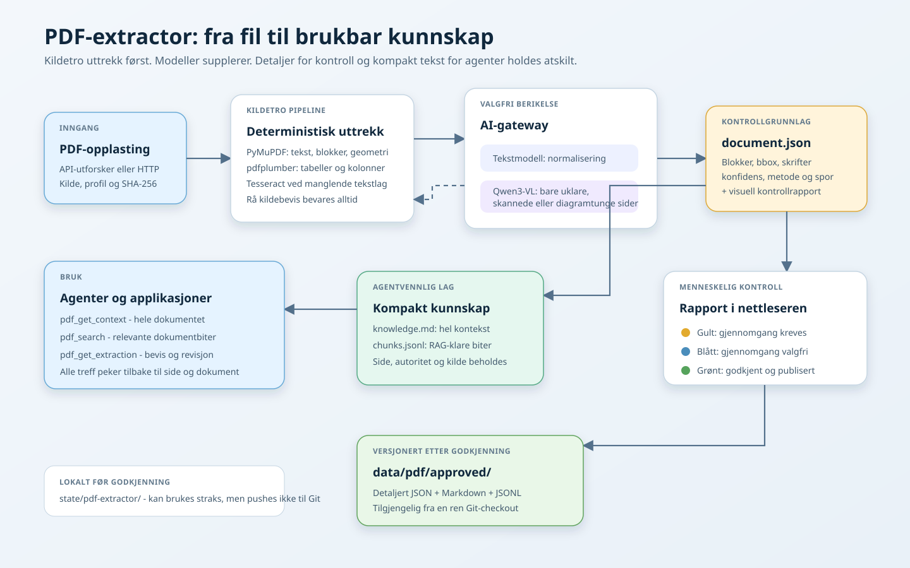

# PDF-extractor

Python-tjeneste for kildeforankret uttrekk fra generelle PDF-er, lover,
forskrifter, regelverk, arealplaner og områdereguleringer. `generic` bevarer
struktur uten juridiske antakelser, `legal` finner nummererte regler, og
`arealplan` legger til plan- og kartmetadata.

Rå tekstblokker, side, koordinater og metode blir alltid bevart. OCR og
bildeanalyse supplerer kilden; modelltekst får aldri overskrive den.

Leserekkefølgen utledes fra generell sidegeometri: gjentatte topp- og
bunntekster skilles fra innholdet, tekstblokkenes startposisjoner grupperes i
kolonner, og overlappende blokker markeres som strukturelt usikre. Innholdssider
gjenkjennes fra overskrift og tetthet av nummererte oppføringer, ikke fra et
bestemt dokumentnavn, kommunenavn eller sidenummer. Den medfølgende Bergen-PDF-en
er en regresjonsfixture for denne generelle logikken.

## Lagring

- Runtime: `state/pdf-extractor/documents/<documentId>/`. Her ligger original-PDF,
  `document.json`, kontrollrapport, siderenderinger, `knowledge.md` og `chunks.jsonl`.
- Godkjente uttrekk: `data/pdf/approved/`. En godkjenning publiserer tre filer:
  detaljert `<id>.json`, kompakt `<id>.knowledge.md` og RAG-klare
  `<id>.chunks.jsonl`.
- Representative test-PDF-er: `data/pdf/fixtures/`

`./start.sh --reset` sikkerhetskopierer runtime-data til `_backup/`. Normal
ekstraksjon skriver aldri i `data/`.

`document.json` er kontrollgrunnlaget: rå blokker, koordinater, skrifter,
konfidens, metode og modellspor. Det er med vilje detaljert. Agenter bør normalt
bruke `GET /dokumenter/{id}/kunnskap` for hel kontekst eller `POST /sok` for
målrettet semantisk gjenfinning. `POST /sok` bruker en vedvarende SQLite-basert
vektordatabase under `state/pdf-extractor/`; den flerspråklige embeddingmodellen
ligger ferdig i Docker-imaget. Det finnes ingen plan- eller PDF-spesifikk
søkerangering. Begge svarene beholder dokument-ID, side og innholdstype, slik at
et svar kan føres tilbake til kontrollgrunnlaget.

## Kontroll og godkjenning

Den visuelle rapporten viser én av tre tilstander:

- Gult: gjennomgang kreves for juridiske dokumenter og arealplaner, OCR,
  forsøkt bildeanalyse, advarsler eller lav konfidens.
- Blått: gjennomgang er valgfri for et rent, digitalt generelt dokument.
- Grønt: et menneske har godkjent uttrekket og publisert kunnskapsfilene.

Et lokalt uttrekk kan brukes med en gang. Godkjenning er nødvendig først når
innholdet skal bli et varig, versjonert kunnskapsgrunnlag i `data/pdf/approved/`.
Kontrolløren kan godkjenne direkte i rapporten, uten terminal.



## CLI

```bash
python -m venv .venv
.venv/Scripts/python -m pip install -r apps/pdf-extractor/requirements.txt
set PYTHONPATH=apps/pdf-extractor
.venv/Scripts/python -m pdf_extractor extract data/pdf/fixtures/b65270000.pdf --profile arealplan
```

Et menneskelig kontrollert uttrekk kan publiseres som seed-data:

```bash
.venv/Scripts/python -m pdf_extractor publish <documentId> --reviewed
```

HTTP-flyten er opplasting til `POST /dokumenter`, jobbstart på
`POST /dokumenter/{id}/uttrekk`, status på `GET /jobber/{id}` og resultat eller
visuell rapport under dokumentet. Helseendepunktet viser konfigurert
bildeanalysemodell.

## Modeller

`./start.sh` måler tilgjengelig RAM og, når det finnes, NVIDIA-VRAM. Skriptet
velger og laster ned både en lokal tekstmodell og en Qwen3-VL-modell som passer
maskinen før tjenestene startes. Et eksplisitt `OLLAMA_VISION_MODEL` i miljøet
eller `.env` overstyrer automatisk valg. Modellen kan også klargjøres manuelt:

```bash
ollama pull qwen3-vl:4b
```

Bildeanalyse brukes bare for skannede, diagramtunge eller strukturelt uklare
sider. Tilgjengeligheten sjekkes én gang før uttrekket, slik at en manglende
modell ikke gir ett langt tidsavbrudd per side. Manglende modell stopper ikke
uttrekket; OCR og kildeblokker beholdes, og tilgjengeligheten vises i
JSON-resultatet og kontrollrapporten.
