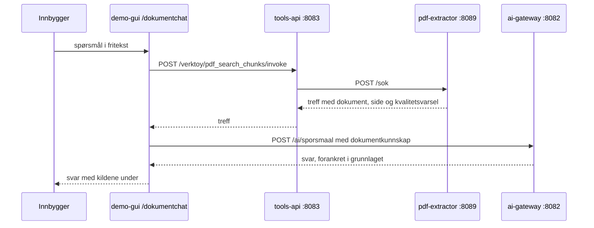

# Dokumentchat: spør regelverket, og se hvor svaret kom fra

Regelverket for et byggetiltak ligger i seks dokumenter på flere hundre sider til
sammen. Dokumentchatten er inngangen til dem: du skriver et spørsmål i fritekst, og får
et svar med dokument og sidetall under.

Den kjører på <http://localhost:3001/dokumentchat>, uten prosessøkt og uten innlogging.
Det er med vilje. Chatten leser bare offentlig regelverk, og har ingen tilgang til
opplysninger om en person eller en eiendom - så det er ingenting her å logge inn for.

**PDF-ene indekseres ikke ved oppstart.** Kommandoen som laster dem inn står i
[`README.md`](../README.md#det-vi-bygget). Uten den svarer chatten «Søket fant ingen
relevante utdrag i de indekserte dokumentene», og `GET http://localhost:8089/dokumenter`
viser hva som faktisk ligger inne.

**Og `./start.sh --reset` sletter indeksen.** Den gjør `rm -rf state`, og indeksen ligger i
`state/pdf-extractor`. Etter en reset svarer chatten derfor «Søket fant ingen relevante
utdrag» til kommandoen over er kjørt på nytt. Kildene er trygge: de seks PDF-ene og
manifestet ligger i `data/pdf/fixtures/`, som er seed-data og ikke røres av en reset, så
opplastingen trenger ikke nett - bare de par minuttene uttrekket tar.

Verdt å vite om plassen: `--reset` kopierer hele `state/` til `_backup/` før den sletter,
indeksen inkludert. Med de seks kildene inne er det om lag 350 MB per reset, og ingenting
leser kopien. `_backup/README.md` sier at katalogene der kan slettes for hånd.

## Hva den er til for

Gebyrtallene i kostnadsoverslaget i [`README.md`](../README.md#hva-de-700-sakene-koster)
ble funnet ved å spørre den. Artiklene `2026-440`, `2026-441` og `2026-3191` står i
Bergen kommunes gebyrforskrift, som er én av de seks kildene, og de var raskere å finne
med et spørsmål enn ved å lese forskriften. Det er det beste vi har å si om nytten: den
svarte på et spørsmål vi faktisk hadde.

Den samme dokumentbasen brukes to steder. Tiltakshjelpen henter fra den gjennom
`pdf_search_chunks` når rådet skrives, og dokumentchatten gjennom det samme verktøyet
uten en prosess rundt. Én dokumentbase, to innganger - og det er derfor uttrekket er en
egen tjeneste framfor en del av casen.

## De to kallene

Chatten legger ikke til et eget endepunkt i backend. Den setter sammen to som fantes.

Søket ber om fem treff. `ai-gateway` beholder tre, og kutter hver tekst til 1800 tegn.
Et bredere søk gir altså ikke et bredere svar.

## Fra side til svar

Det som gjør at et svar kan føres tilbake til siden det står på, er at side, metode og
kontrollstatus følger med hele veien. Uttrekket er dokumentert i
[`apps/pdf-extractor/README.md`](../apps/pdf-extractor/README.md); her står det som har
noe å si for chatten.

**Oppdelingen.** `apps/pdf-extractor/pdf_extractor/knowledge.py` lager to slags biter.
En `rule`-bit per bestemmelse, slik at et paragrafnummer holder sammen i ett treff, og
en `section`-bit per side og autoritetsnivå for det som ikke er en bestemmelse. Grensen
er 3500 tegn og det er ingen overlapp mellom bitene. Autoritetsnivåene er `binding`,
`guidance`, `informative` og `unknown` - en forskriftstekst og en veiledning til den
samme forskriften er ikke det samme, og skillet er derfor med i dataene framfor å
overlates til leseren.

**Det hver bit bærer.** `documentId`, `page`, `authority`, `ruleIds`, `sourceSha256`,
`knowledgeStatus`, `checkRecommended` og `qualityWarnings`. Kvalitetsvarslene er det
uttrekket selv er i tvil om, og de vises framfor å bli ryddet bort.

**Vektorlaget.** SQLite i `state/pdf-extractor/vectors.sqlite3`, med vektorene lagret
som float32. Søket er en **full skanning**: alle bitene leses, cosinus regnes ut i
Python, og treffene sorteres på poengsum og deretter på dokument, side og bit-id, slik
at to like søk gir samme rekkefølge. Ingen ANN-indeks. Det er riktig for seks
dokumenter: en tilnærmet indeks ville lagt til en avhengighet og et avvik uten å svare
bedre, og full skanning er dessuten det eneste som ikke kan utelate et treff.

Embeddingmodellen er `paraphrase-multilingual-MiniLM-L12-v2` gjennom fastembed, og den
er lastet ned i image-bygget. Containeren starter derfor uten å hente noe over nett.

**Idempotens.** `index_fingerprint` er en sha256 over indeksversjon, modellnavn,
dokument-id og bitene. Samme PDF lastet opp igjen gir samme indeks, og
`has_current_index` avviser et søk mot en indeks som er blitt utdatert framfor å svare
fra den. `INDEX_VERSION` er i dag 3; en endring av den tømmer tabellene, slik at en ny
oppdelingsregel ikke blandes med biter fra den gamle.

## Det chatten ikke gjør

Hvert ledd her er kode, ikke en instruks i prompten.

**Ingen treff gir ikke et svar.** Finner søket ingenting, svarer siden med fast tekst og
**modellen kalles ikke i det hele tatt**. Det er ikke en feilmelding som er pyntet bort;
det er at det ikke finnes noe grunnlag å svare fra.

**Grunnlaget er klemt før modellen ser det.** `projectTiltakshjelpenDokumentkunnskap` i
[`apps/shared/tiltakshjelpen-kunnskap.ts`](../apps/shared/tiltakshjelpen-kunnskap.ts)
beholder tre treff, kutter hver tekst til 1800 tegn, krever at en kildelenke er en
`http`- eller `https`-adresse, og setter `checkRecommended` til `true` og
`scopeVerified` til `false` uansett hva treffet selv sa. Et treff i en PDF kontrollerer
aldri et vilkår alene, og det er dataene som sier det, ikke en formulering i teksten.

**Spørsmålet er data, ikke en instruks.** Det pakkes i `<sporsmaal>`-merker og erklæres
som data i prompten, og prompten sier at modellen bare skal svare ut fra grunnlaget,
ikke regne ut noe selv og ikke treffe en avgjørelse.

**Chatten kan ikke nå opplysninger bak samtykkeporten.** `/ai/sporsmaal` har ingen egen
datatilgang. Den svarer bare fra grunnlaget kalleren sender med, og det er strukturen
som stopper den, ikke en regel den kunne brutt.

**Den havner ikke på Tiltakshjelpens svarvei.** Tjenestenavnet i konteksten er
`Dokumentarkiv`, valgt for at det ikke skal treffe `isTiltakshjelpenKontekst` i
`ai-gateway`. Et spørsmål om TEK17 skal svares som et spørsmål om TEK17, ikke som et
ledd i en tiltaksvurdering.

## Sporet

Søket logges i tabellen `retrieval_audit` i samme base: hva slags operasjon det var, og
hvilke dokumenter og biter som ble brukt. **Spørringen og teksten lagres ikke** - det
står i `record_retrieval` i `vector_store.py`, som eneste kommentar på funksjonen, fordi
det er den avgjørelsen som er verdt å vite om. Loggen svarer på hvilke kilder som er
brukt, ikke på hva noen har spurt om. Les den på `GET http://localhost:8089/revisjon`.

Modellkallet ligger i KI-sporet: `state/ai-trace.jsonl`, og
<http://localhost:8082/trace> viser prompt, svar, modell og tenking slik modellen faktisk
fikk og ga det.

## Kildene

Seks dokumenter, registrert i
[`data/pdf/fixtures/manifest.json`](../data/pdf/fixtures/manifest.json) med utsteder,
hentetidspunkt og sha256.

| Dokument | Profil | Hva den svarer på |
|---|---|---|
| Byggesaksforskriften (SAK10) med veiledning, Direktoratet for byggkvalitet | `legal` | Vilkårene for unntak fra søknadsplikt |
| Byggteknisk forskrift (TEK17) med veiledning, Direktoratet for byggkvalitet | `legal` | Høyder, avstander og tekniske krav |
| Plan- og bygningsloven, Lovdata | `legal` | Hjemlene vurderingen bygger på |
| KPA2018: bestemmelser og retningslinjer, Bergen kommune | `arealplan` | Planbestemmelsene selv |
| Bergen kommunes gebyrforskrift | `legal` | Hva en søknad eller en tilsynssak koster |
| Statens vegvesen: «Dette må du tenke på» | `legal` | Frisikt og avkjørsel mot vei |

Profilen avgjør hvordan dokumentet deles opp. `legal` leter etter bestemmelser og lager
en bit per paragraf; `arealplan` er tilpasset et plandokument. Gebyrforskriften og
vegvesen-veiledningen står som `legal` fordi de har en bestemmelsesstruktur å dele etter
- det er den oppdelingen gebyrartiklene over ble funnet i.

**Ingen av dokumentene er kontrollert av en fagperson.** De er hentet fra utstederen og
indeksert som de er.

## Det som ikke er gjort

- **Chatten har ingen tester.** Verken `apps/demo-gui/src/client/dokumentchat.ts` eller
  `dokumentchat.html` er dekket. Vektorlaget under er testet i
  `apps/pdf-extractor/tests/test_extractor.py`, som `pnpm test:pdf` kjører - men den
  står ikke i CI, så den må kjøres for hånd.
- **PDF-ene indekseres ikke ved oppstart.** Verken `start.sh` eller
  `docker-compose.yml` laster dem inn.
- **Planbestemmelsene leses ikke automatisk av regelen.** At KPA2018 ligger i
  dokumentbasen betyr at du kan spørre om den, ikke at Tiltakshjelpen har kontrollert
  den. Det skillet står i [`docs/tiltakshjelpen.md`](tiltakshjelpen.md).
